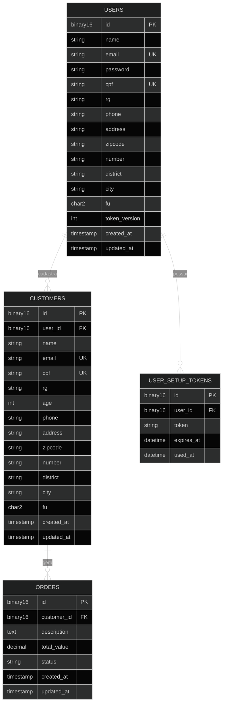

# ADX GLOBAL BASE

Esta é uma API RESTful de nível empresarial para gestão de ecossistemas de usuários da aplicação, clientes e pedidos, desenvolvida sob os mais rigorosos padrões de Software Architecture.
O projeto abandona o modelo convencional de frameworks (Active Record/MVC Simples) em favor de uma estrutura resiliente, testável e de baixa carga cognitiva.

## Core Architecture

O projeto foi construído utilizando a metodologia **SDD** (Spec-Driven Development), garantindo que cada linha de código tenha uma finalidade técnica e estratégica.

- **Clean Architecture:** Separação total entre camadas de Domínio, Aplicação e Infraestrutura.
- **S.O.L.I.D. & DRY:** Garantia de responsabilidade única e reaproveitamento lógico.
- **Domain-Driven Design (Lite):** Uso de Value Objects (Email, Cpf, Password, Uuid) para garantir a integridade dos dados antes da persistência.
- **Flat Code & Linear Code:** Identação minimalista utilizando Guard Clauses para eliminar o uso de else e aninhamentos complexos.
- **Minimalismo Cognitivo:** Implementação de Single-Line Guard Clauses, permitindo que o revisor foque no 'Happy Path' da aplicação.

### Modelagem de Dados (ERD)

Abaixo, a estrutura de persistência focada em performance, utilizando UUIDs (Binary 16) e relacionamentos de integridade referencial rigorosa.

## ADX (Architect & Developer Experience)

Este projeto foi desenhado focando no conceito de **ADX**, garantindo uma experiência superior em duas frentes:

### Architect Experience (AX):
Uso de Named Arguments Unpacking & Spread Operator (PHP 8+) para criação de objetos, desacoplando a ordem dos parâmetros e garantindo sinergia total entre DTOs e Entities.

### Developer Experience (DX):
Documentação viva via Swagger UI integrada com ferramentas de utilidade (como o Binary to Hex Converter) diretamente no portal da API, reduzindo o context switching.

# Como usar

### O projeto utiliza a estratégia Turnkey (chave na mão), bastando seguir os simples passos abaixo:

- **Requisitos:** PHP 8.3+ e MySQL 8.0+.
- **Base de Dados:** Importe o arquivo database.sql (contém a estrutura de BINARY(16) para UUIDs).
- **Ambiente:** O arquivo .env já está pré-configurado para ambiente de desenvolvimento local.
- **Setup Master:** Execute o endpoint (abaixo) de recuperação para criar o administrador inicial:
- **Endpoint:** POST /api/users/setup/master (JSON: { "secret": "ADX_MASTER_RECOVERY_2026" }).
- **Swagger:** Acesse /docs ou o caminho configurado no seu servidor local.

## Endpoints da API

## Auth & Recovery (Públicos)

| **MÉTODO** | **ENDPOINT** | **DESCRIÇÃO** | **PAYLOAD (JSON)** |
| :--- | :--- | :--- | :--- |
| **POST** | /login | Autenticação e geração de JWT | {"email": "...", "password": "..."} |
| **OPTIONS** | /login | Pre-flight CORS | - |
| **POST** | /api/users/setup/master | Criar Admin inicial (Recovery) | {"secret": "ADX_MASTER_RECOVERY_2026"} |

## TDD & Auditoria (Públicos)

| **MÉTODO** | **ENDPOINT** | **DESCRIÇÃO** | **PAYLOAD (JSON)** |
| :--- | :--- | :--- | :--- |
| **GET** | /api/tests/audit | Execute o comando **composer test:report**, gerando um arquivo de Report com os Testes Unitários | { Returna a URL com o Relatório de Auditoria }

## Users (Usuários)

Filtro: auth (Bearer Token obrigatório).

| **MÉTODO** | **ENDPOINT** | **DESCRIÇÃO** |
| :--- | :--- | :--- |
| **GET** | /api/users | Listar todos os usuários do sistema |
| **POST** | /api/users | Cadastrar novo usuário (Admin/Staff) |
| **GET** | /api/users/{id} | Detalhes de um usuário específico (ID Hex) |
| **PUT** | /api/users/{id} | Atualizar dados do usuário |
| **DELETE** | /api/users/{id} | Remover usuário |

## Customers (Clientes)

Filtro: auth (Bearer Token obrigatório).

| **MÉTODO** | **ENDPOINT** | **DESCRIÇÃO** |
| :--- | :--- | :--- |
| **GET** | /api/customers | Listar todos os clientes |
| **POST** | /api/customers | Cadastrar novo cliente |
| **GET** | /api/customers/{id} | Detalhes do cliente (ID Hex) |
| **PUT** | /api/customers/{id} | Atualizar dados do cliente |
| **DELETE** | /api/customers/{id} | Remover cliente |
| **GET** | /api/customers/user/{id} | Listar clientes vinculados a um usuário |

## Orders (Pedidos)

Filtro: auth (Bearer Token obrigatório).

| **MÉTODO** | **ENDPOINT** | **DESCRIÇÃO** |
| :--- | :--- | :--- |
| **GET** | /api/orders | Listar todos os pedidos |
| **POST** | /api/orders | Cadastrar novo pedido |
| **GET** | /api/orders/{id} | Detalhes do pedido (ID Hex) |
| **PUT** | /api/orders/{id} | Atualizar status ou dados do pedido |
| **DELETE** | /api/orders/{id} | Cancelar/Excluir pedido |
| **GET** | /api/orders/user/{uid} | Listar pedidos por Usuário |
| **GET** | /api/orders/customer/{cid} | Listar pedidos por Cliente |

## Diferenciais Técnicos

| **FEATURE** | **DESCRIÇÃO** |
| :--- | :--- |
| **Binary UUID** | Armazenamento otimizado em BINARY(16) no MySQL para alta performance em indexação. |
| **Argon2id** | Algoritmo de hashing de última geração para senhas (configurado via VO Password). |
| **Named Unpacking** | Uso de ...array_merge((array) $dto, [...]) para instanciar entidades com segurança. |
| **Guard Clauses** | Código 100% linear, eliminando complexidade ciclomática. |
| **Smart Auto-Auth** | Customização do Swagger para captura automática do JWT no Login e injeção instantânea no Header Authorize via Modal. |
| **Swagger Utility** | Conversor `bin2hex` integrado ao rodapé da documentação (/docs (swagger)) para facilitar o debug. |
| **TDDash Automated Auditor** | Botão integrado na UI do Swagger que faz a chamada para o barramento de testes local, dispara o PHPUnit, limpa o log de regressão de dados e injeta o link do relatório interativo de cobertura diretamente na tela. |

## IA com SDD (Spec-Driven Development)

Este sistema **NÃO** é fruto de "Vibe Coding". A Inteligência Artificial foi utilizada como uma aceleradora estratégica, sob supervisão técnica rigorosa do Arquiteto de Software. A metodologia **SDD** aplicada aqui garante que a automação siga padrões de arquitetura consolidados, resultando em um código confiável, funcional, livre de preocupações de 'quebras' no futuro. Utilizei IA como um braço/produtividade, onde analisei cada linha de código ajustando/refatorando e concluindo com testes exaustivos.

#### Arquitetura de Stack e Visão de Engenharia
Este repositório serve como um showcase técnico de engenharia de elite, demonstrando como o PHP 8.5 moderno e o CodeIgniter 4.7 (Latest) podem ser elevados ao nível Enterprise quando combinados com os padrões arquiteturais corretos. Minha abordagem transpõe conceitos avançados e rigorosos do ecossistema .NET (onde possuo certificação Microsoft desde 2004 e três décadas de estrada) diretamente para o ecossistema PHP, unindo tipagem estrita, performance bruta e desacoplamento real em camadas.

> **NOTA DE PORTABILIDADE:** Como o domínio da aplicação foi desenhado de forma totalmente agnóstica a frameworks ou acoplamentos de infraestrutura, este ecossistema está estrategicamente preparado para ser migrado integralmente para **.NET 10 / C# 14 com SQL Server** (infraestruturas Azure-native de alta escala) com esforço de remapeamento de código próximo a zero.

## Resiliência e Operação: Disaster Recovery
A API implementa um protocolo de Disaster Recovery via Shared Secret na camada de Usuários. Isso permite a reinicialização controlada do acesso administrativo sem intervenção direta no banco de dados. Este fluxo garante a continuidade operacional mesmo em cenários de perda total de credenciais, mantendo a integridade absoluta das regras de negócio e dos Value Objects.

## Excelência Arquitetural: Named Arguments Unpacking
Utilizo uma das funcionalidades mais sofisticadas do PHP moderno: o desempacotamento de argumentos nomeados aliado ao Spread Operator. Ao instanciar entidades através da expressão new self(...array_merge((array) $dto, [...])), elevamos o nível de segurança da aplicação:

- **Desacoplamento de Ordem:** O desempacotamento por nome garante que cada valor seja injetado no parâmetro correto, independente de sua posição na assinatura, mitigando erros humanos em refatorações.
- **Sinergia DTO-Entity:** Transformamos o DTO em um mapa de argumentos dinâmico, mesclado aos Value Objects processados. O resultado é uma factory limpa e linear.
- **Carga Cognitiva Reduzida:** A sintaxe elimina código boilerplate, permitindo que o foco da revisão seja a intenção da regra de negócio, não o transporte de dados.
- **Minimalismo Cognitivo: Sintaxe Linear (Flat Code)**: Adoto o padrão de Single-Line Guard Clauses para validações de fluxo único (if ($condition) return $result;). Esta prática, comum em ambientes de alta performance, prioriza o tempo do revisor e a saúde do código:
- **Verticalidade Estratégica:** Condensar validações atômicas preserva o espaço vertical para a Lógica de Negócio Real, evitando o scrolling excessivo.
- **Leitura Unidirecional:** O código é projetado para ser "escaneável". O desenvolvedor identifica pontos de saída precoce (Early Return) instantaneamente, mantendo o foco no "Happy Path" da aplicação.
- **Estética Clean Code:** A ausência de ruído visual (chaves e quebras de linha extras) reflete uma mentalidade de precisão e reduz a complexidade ciclomática.

## Developer Experience (DX) e Integração

Para otimizar o fluxo do desenvolvedor integrador, a documentação Swagger acoplada ao projeto inclui uma ferramenta de conversão de tipos (Binary-to-Hex). Esta utilidade mitiga erros de formatação no consumo dos UUIDs persistidos em formato binário, unindo a performance de armazenamento do MySQL com a facilidade de debug do formato hexadecimal.

## Rafael Peres

Software Architect | Developer Fullstack Senior 
**|** Microsoft Certified Professional